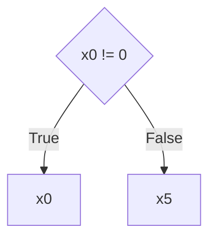

# LAC program catalog — symbolic collapse report

_15 collapsed | 3 guarded | 4 unrolled | 0 loop-symbolic | 7 blocked-by-opcode (total 29)._

**What the polynomial column means (issue #69 update).** For collapsed
rows the polynomial column is the *structural* output of both the
symbolic executor and the FF bilinear form on `forward_symbolic` — not
just a numerical agreement. See
[`ff_symbolic_equivalence.md`](ff_symbolic_equivalence.md) for the
construction and the test-level proof over all 15 collapsed rows.

**Reading the status columns.** _Collapsed_ rows are straight-line
programs that reduce to a single polynomial (the issue-#65 claim).
_Guarded_ rows contain finite conditionals (JZ/JNZ on symbolic
inputs) and reduce to a `GuardedPoly` — a partitioned case table
whose cases together cover the domain. _Unrolled_ rows contain
bounded loops with concrete trip counts: the executor runs them
in `input_mode="concrete"` (every PUSH is specialised to its
literal arg) so the loop unrolls by execution rather than by
invariant inference. "Unrolled at n=5" is therefore a claim
about a specific input, **not** a symbolic proof over all n.

## Collapsed (branchless, polynomial-closed)

| Program | k heads | # mono | poly | eml size | eml depth | match |
|---|---:|---:|---|---:|---:|:-:|
| `basic_add` | 3 | 2 | `x0 + x1` | 21 | 6 | ✓ |
| `push_halt` | 1 | 1 | `x0` | 1 | 0 | ✓ |
| `push_pop` | 3 | 1 | `x0` | 1 | 0 | ✓ |
| `dup_add` | 3 | 1 | `2*x0` | 35 | 8 | ✓ |
| `multi_add` | 5 | 3 | `x0 + x1 + x2` | 41 | 10 | ✓ |
| `stack_depth` | 5 | 1 | `x0` | 1 | 0 | ✓ |
| `overwrite` | 3 | 1 | `x2` | 1 | 0 | ✓ |
| `complex` | 6 | 2 | `2*x1 + 2*x2` | 89 | 12 | ✓ |
| `many_pushes` | 19 | 10 | `x0 + x1 + x2 + x3 + x4 + x5 + x6 + x7 + x8 + x9` | 181 | 38 | ✓ |
| `alternating` | 7 | 4 | `x0 + x1 + x3 + x5` | 61 | 14 | ✓ |
| `native_multiply(3,7)` | 3 | 1 | `x0*x1` | 35 | 8 | ✓ |
| `square_via_dupmul(9)` | 3 | 1 | `x0^2` | 43 | 12 | ✓ |
| `sum_of_squares(3,4)` | 7 | 2 | `x0^2 + x3^2` | 105 | 16 | ✓ |
| `dup_add_chain_x4` | 9 | 1 | `16*x0` | 35 | 8 | ✓ |
| `add_dup_add` | 5 | 2 | `2*x0 + 2*x1` | 89 | 12 | ✓ |

## Collapsed (guarded — finite conditionals)

Each case is `guards ⇒ value_poly`. Guarded dispatch has two
EML costs: the **value** trees (one per case's `value_poly`)
and the **guard** trees (one per `Guard` in every case's
conjunction). Both are reported separately rather than rolled
together — so the "what does one execution cost?" number and
the "what does it take to realise the whole case table?"
number stay distinguishable. _value Σ size_ / _value max depth_
sum and max across cases' value trees; _guard Σ size_ / _guard
max depth_ do the same across every guard tree.

**Visualising partition structure.** The flat `[(guards, value), ...]`
table can be rendered as a decision-tree diagram via
`symbolic_executor.guarded_to_mermaid(gp)`. Example for
`clamp_zero(5)`:

| Program | k heads | # cases | cases | value Σ size | value max depth | guard Σ size | guard max depth | match |
|---|---:|---:|---|---:|---:|---:|---:|:-:|
| `select_by_sign(7)` | 5 | 2 | `{x0 != 0} → x4` `{x0 == 0} → x7` | 2 | 0 | 2 | 0 | ✓ |
| `clamp_zero(5)` | 5 | 2 | `{x0 != 0} → x0` `{x0 == 0} → x5` | 2 | 0 | 2 | 0 | ✓ |
| `either_or(3,7,1)` | 6 | 2 | `{x2 != 0} → x1` `{x2 == 0} → x0` | 2 | 0 | 2 | 0 | ✓ |

## Collapsed (unrolled at the catalog's concrete inputs)

| Program | k heads | # mono | poly | eml size | eml depth | match |
|---|---:|---:|---|---:|---:|:-:|
| `fibonacci(5)` | 50 | 1 | `5` | 1 | 0 | ✓ |
| `factorial(4)` | 45 | 1 | `24` | 1 | 0 | ✓ |
| `is_even(6)` | 35 | 1 | `1` | 1 | 0 | ✓ |
| `power_of_2(4)` | 45 | 1 | `16` | 1 | 0 | ✓ |

## Blocked (out of symbolic-executor scope)

| Program | reason | blocker |
|---|---|---|
| `native_divmod(2,7)` | non-polynomial op | `DIV_S` |
| `native_clz(16)` | non-polynomial op | `CLZ` |
| `native_abs_unary(-3)` | non-polynomial op | `ABS` |
| `native_neg(5)` | non-polynomial op | `NEG` |
| `compare_lt_s(3,5)` | non-polynomial op | `LT_S` |
| `bitwise_and(12,10)` | non-polynomial op | `AND` |
| `native_max(3,5)` | non-polynomial op | `GT_S` |

